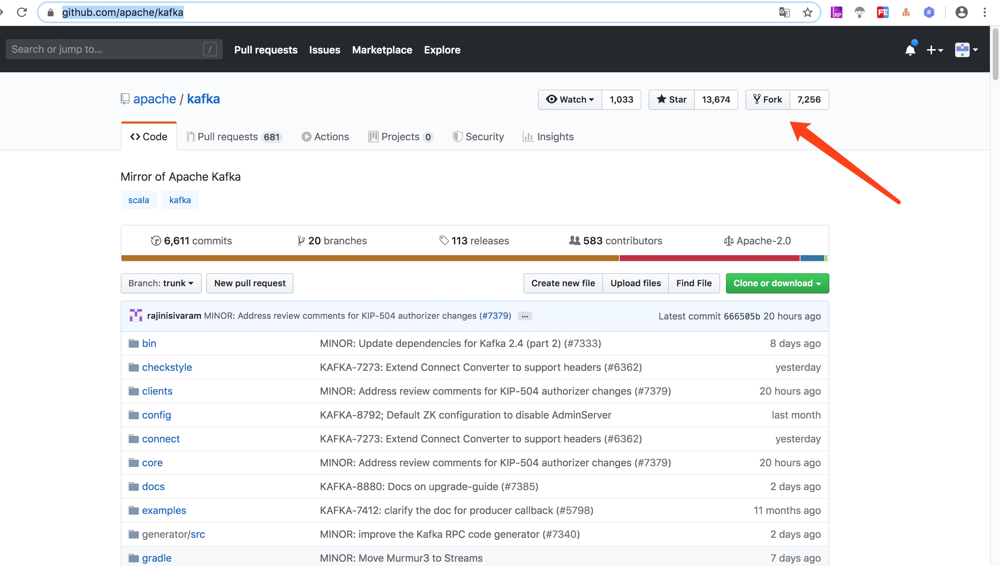
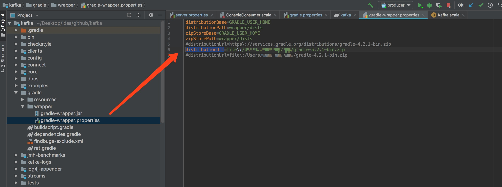
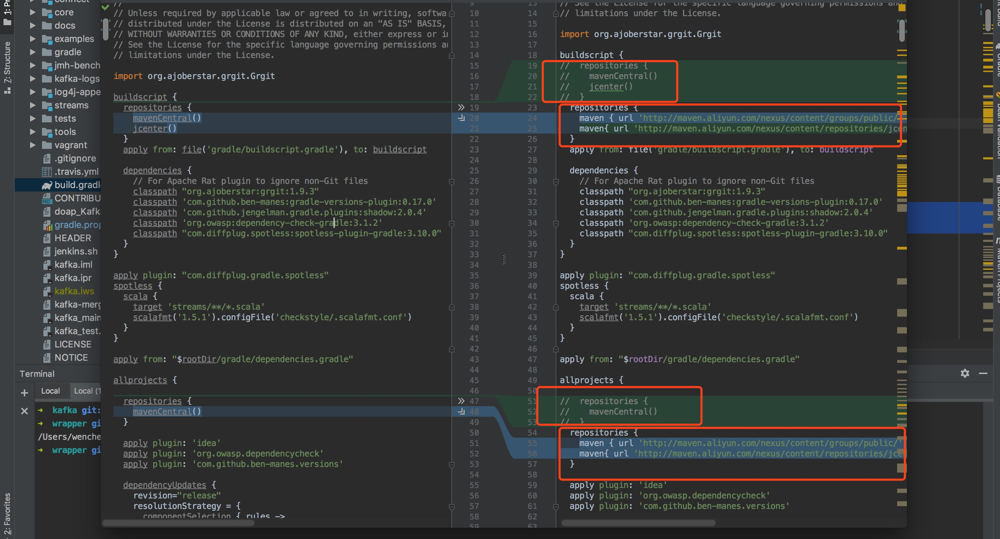
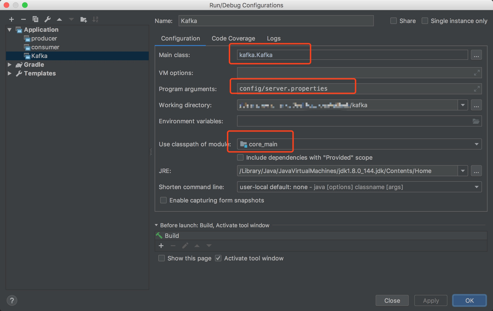
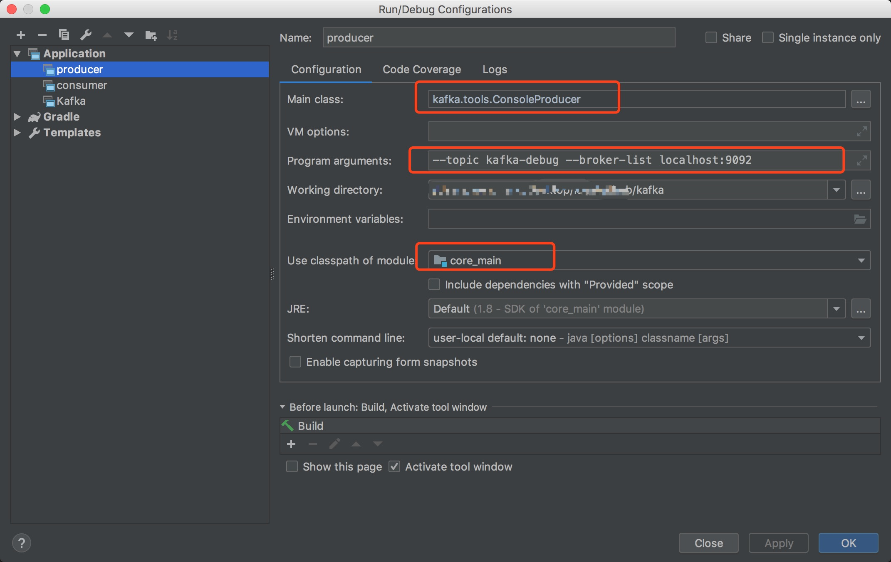
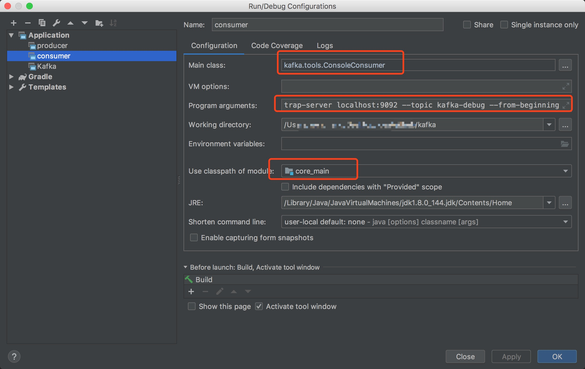
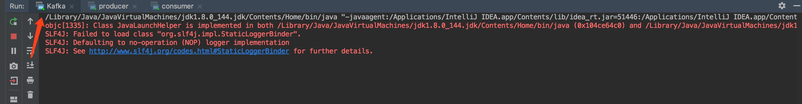
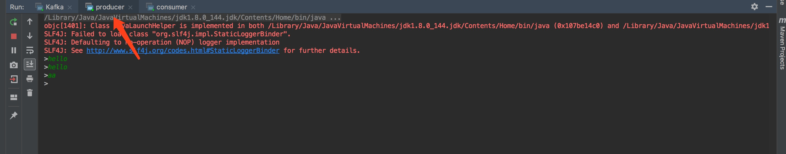
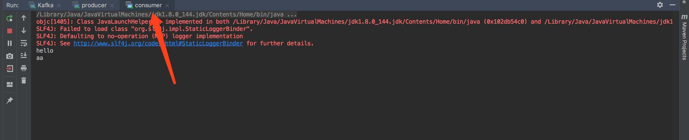

## fork [kafka源码](https://github.com/apache/kafka)


## 环境配置
1. jdk 环境配置
2. scala 环境配置
3. gradle 安装配置
4. maven 安装配置
5. zookeeper 安装配置
6. IntelliJ IDEA中安装scala插件
    

## idea 导入 kafka 源码

### 导入前优化

#### gradle 配置加速
将项目路径下 `gradle/wrapper` 目录下的 `gradle-wrapper.properties` 文件的 **distributionUrl** 指定为本地的 gradle 压缩包。如下所示:


##### 项目 scala 版本与 本地 scala 运行环境版本配置保持一致
将项目路径下的 `gradle.properties` 的 **scalaVersion** 指定为本地 scala 环境保持一致

#### gradle repositories 加速
修改项目路径下的 `build.gradle` 的 **repositories**，修改后内容如下:
```groovy
  repositories {
    maven { url 'http://maven.aliyun.com/nexus/content/groups/public/' }
    maven{ url 'http://maven.aliyun.com/nexus/content/repositories/jcenter'}
  }
```
    


### 导入源码
上面的优化完成后，将 kafka 源码导入 idea，等待 gradle 完成依赖下载。下载源修改为 阿里云 后，就比较快了。如果用的是 maven 仓库中心，则下载速度会比较慢，一般会下载几个小时，中间可能会失败，需要重新下载。

### 运行环境配置
核心调试代码在 core 模块下
#### 1. 日志文件 log4j.properties 配置文件添加
kafka 运行日志输出使用的是 log4j，需要 log4j 的配置文件，将项目路径下的 config/log4j.properties 拷贝到项目路径 `core/src/main/scala` 目录下。

#### 2. server 启动配置文件 server.properties 修改
可以直接修改项目路径下 `config/server.properties` 的配置内容

#### 3. server 启动配置
【idea】操作路径: run -> Edit Configrations.. -> + -> Application
配置内容：
* **Main class**: `kafka.Kafka`
* **Program arguments**: `config/server.properties`
* **Use classpath of module**: `core_main` 
配置如下:


#### 4. producer 启动配置
【idea】操作路径和上面 server 启动配置一致
配置内容：
* **Main class**: `kafka.tools.ConsoleProducer`
* **Program arguments**: `--topic kafka-debug --broker-list localhost:9092`
* **Use classpath of module**: `core_main` 
配置如下:


#### 5. consumer 启动配置
【idea】操作路径和上面 server 启动配置一致
配置内容：
* **Main class**: `kafka.tools.ConsoleConsumer`
* **Program arguments**: `--bootstrap-server localhost:9092 --topic kafka-debug --from-beginning`
* **Use classpath of module**: `core_main`
配置如下:


#### 6. 启动测试
1. 启动 server
2. 启动 producer
3. 启动 consumer
启动正常后，producer 控制台发送消息，consumer 控制台观察监听消息，如下图所示：
kafka server 启动控制台


kafka producer 启动控制台


kafka consumer 启动控制台
