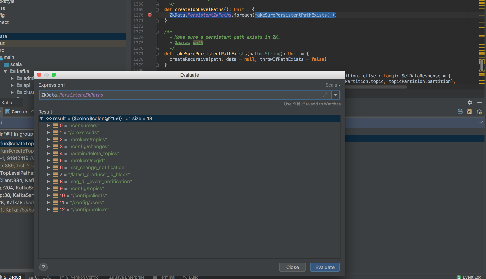
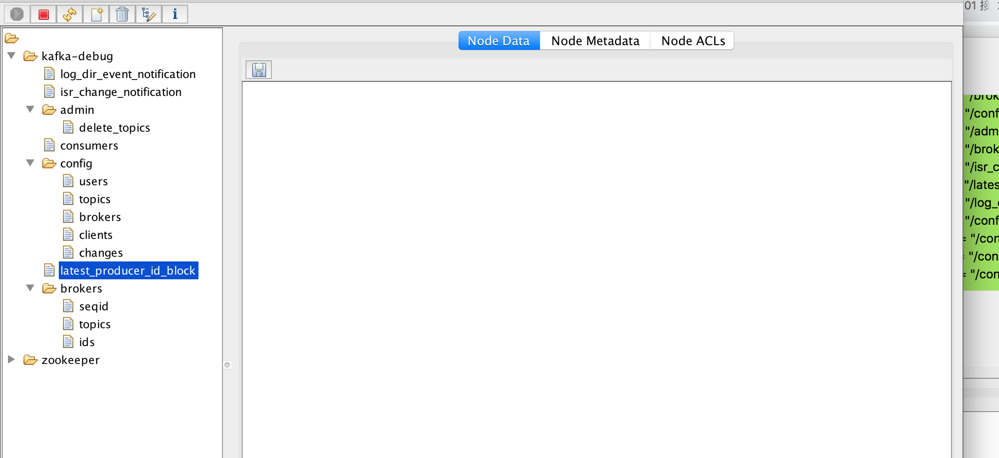
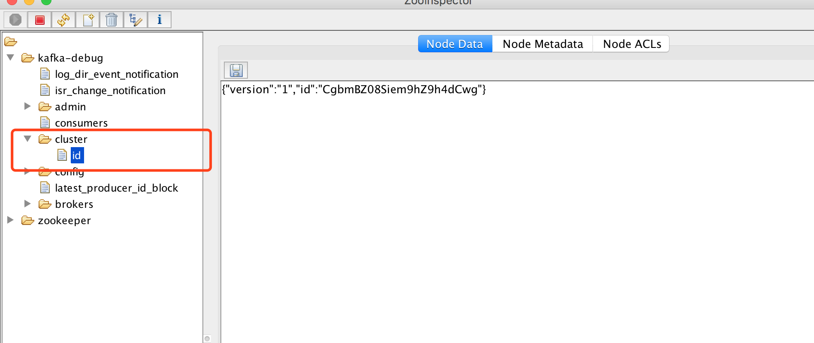

## initZkClient(time) 启动 zkClient 

### 创建 **根目录**,即，`server.properties` 文件中的 `zookeeper.connect` 配置。如下配置中，就会以 `/kafka-debug` 为根目录进行创建。
```properties
zookeeper.connect=tx-node1:2181/kafka-debug
```

### 创建 kafka server 内部业务服务的目录
创建的配置项如下:
```bash
0 = "/consumers"
1 = "/brokers/ids"
2 = "/brokers/topics"
3 = "/config/changes"
4 = "/admin/delete_topics"
5 = "/brokers/seqid"
6 = "/isr_change_notification"
7 = "/latest_producer_id_block"
8 = "/log_dir_event_notification"
9 = "/config/topics"
10 = "/config/clients"
11 = "/config/users"
12 = "/config/brokers"
```


### initZkClient 方法完成后，zk 目录结果



## _clusterId = getOrGenerateClusterId(zkClient): /cluster/id 创建
getOrGenerateClusterId 方法完成后 zk 目录结果


