## nc命令用法举例
> 转自：[nc命令用法举例](https://www.cnblogs.com/nmap/p/6148306.html)

# 什么是nc

nc是netcat的简写，有着网络界的瑞士军刀美誉。因为它短小精悍、功能实用，被设计为一个简单、可靠的网络工具

# nc的作用
* （1）实现任意TCP/UDP端口的侦听，nc可以作为server以TCP或UDP方式侦听指定端口 
* （2）端口的扫描，nc可以作为client发起TCP或UDP连接
* （3）机器之间传输文件
* （4）机器之间网络测速                                                                                                             

# nc的控制参数不少，常用的几个参数如下所列：
* 1) -l
    用于指定nc将处于侦听模式。指定该参数，则意味着nc被当作server，侦听并接受连接，而非向其它地址发起连接。
* 2) -p <port>
    暂未用到（老版本的nc可能需要在端口号前加-p参数，下面测试环境是centos6.6，nc版本是nc-1.84，未用到-p参数）
* 3) -s 
    指定发送数据的源IP地址，适用于多网卡机 
* 4) -u
    指定nc使用UDP协议，默认为TCP
* 5) -v
    输出交互或出错信息，新手调试时尤为有用
* 6）-w
    超时秒数，后面跟数字 
* 7）-z
    表示zero，表示扫描时不发送任何数据

# 前期准备
准备两台机器，用于测试nc命令的用法
主机A：ip地址 10.0.1.161
主机B：ip地址 10.0.1.162

两台机器先安装nc和nmap的包
```bash
yum install nc -y
yum install nmap -y
```

如果提示如下-bash： nc： command not found 表示没安装nc的包
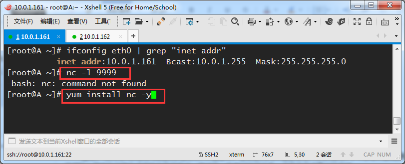

 

# **nc用法1，网络连通性测试和端口扫描**
**nc可以作为server端启动一个tcp的监听（注意，此处重点是起tcp，下面还会讲udp）**
先关闭A的防火墙，或者放行下面端口，然后测试B机器是否可以访问A机器启动的端口
在A机器上启动一个端口监听，比如 9999端口（注意：下面的-l 是小写的L，不是数字1）

默认情况下下面监听的是一个tcp的端口
```bash
nc -l 9999
```
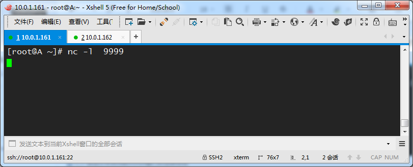

 

**客户端测试，****测试方法1**
在B机器上telnet A机器此端口，如下显示表示B机器可以访问A机器此端口
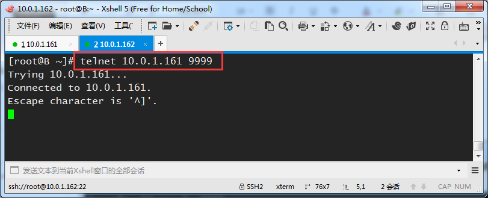


***\*客户端测试，\**测试方法2**
B机器上也可以使用nmap扫描A机器的此端口
```bash
nmap 10.0.1.161 -p9999
```
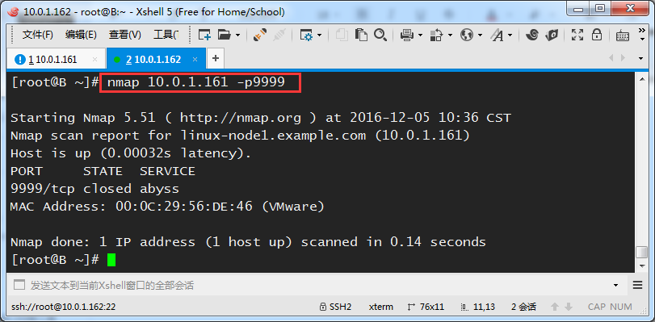

 
***\*客户端测试，\**测试方法3**

使用nc命令作为客户端工具进行端口探测
```bash
# （-v可视化，-z扫描时不发送数据，-w超时几秒，后面跟数字）
nc -vz -w 2 10.0.1.161 9999
```
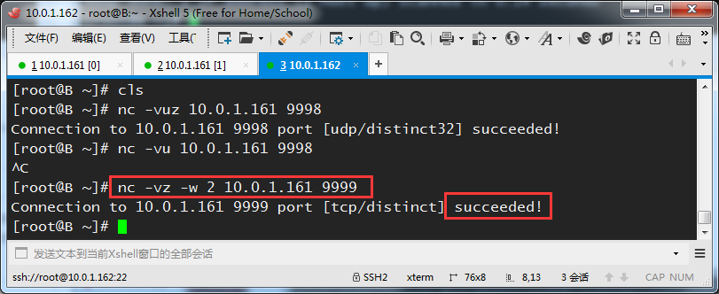

上面命令也可以写成
```bash
nc -vzw 2 10.0.1.161 9999
```
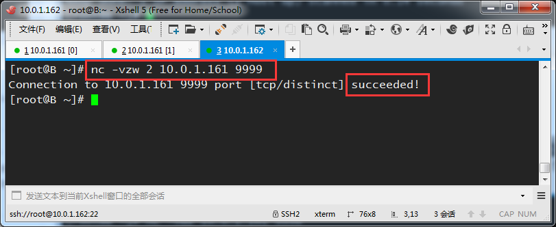


***\*客户端测试，\**测试方法4（和方法3相似，但用处更大）**

nc可以可以扫描连续端口，这个作用非常重要。常常可以用来扫描服务器端口，然后给服务器安全加固

在A机器上监听2个端口，一个9999，一个9998，使用&符号丢入后台
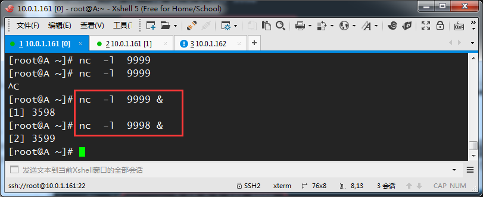

在客户端B机器上扫描连续的两个端口，如下
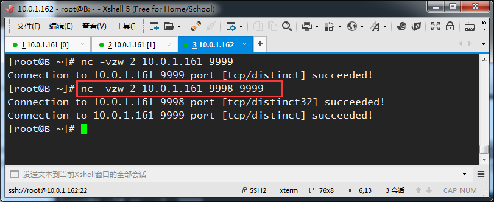

 
**nc作为server端启动一个udp的监听（注意，此处重点是起udp，上面主要讲了tcp）**

启动一个udp的端口监听
```bash
nc  -ul  9998
```


复制当前窗口输入 netstat -antup |grep 9998 可以看到是启动了udp的监听
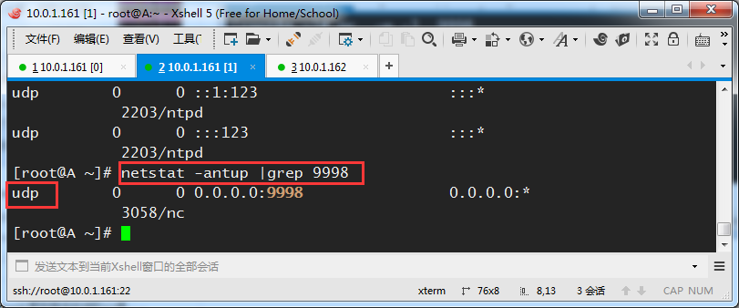


**客户端测试，测试方法1**
```bash
#（telnet是运行于tcp协议的）
#（u表示udp端口，v表示可视化输出，z表示扫描时不发送数据）
nc -vuz 10.0.1.161 9998
```
由于udp的端口无法在客户端使用telnet去测试，我们可以使用nc命令去扫描（前面提到nc还可以用来扫描端口）


上面在B机器扫描此端口的时候，看到A机器下面出现一串XXXXX字符串
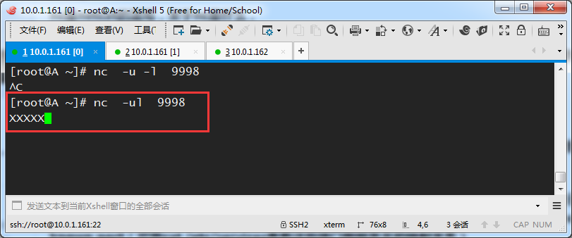

 
**客户端测试，测试方法2**
```bash
nmap -sU 10.0.1.161 -p 9998 -Pn
```
（它暂无法测试nc启动的udp端口，每次探测nc作为server端启动的udp端口时，会导致对方退出侦听，有这个bug，对于一些程序启动的udp端口在使用nc扫描时不会有此bug）

下面，A机器启动一个udp的端口监听，端口为9998
在复制的窗口上可以确认已经在监听了


B机器使用nmap命令去扫描此udp端口，在扫描过程中，导致A机器的nc退出监听。所以显示端口关闭了（我推测是扫描时发数据导致的）
```bash
# -sU ：表示udp端口的扫描
# -Pn ：如果服务器禁PING或者放在防火墙下面的，不加-Pn 参数的它就会认为这个扫描的主机不存活就不会进行扫描了，如果不加-Pn就会像下面的结果一样，它也会进行提示你添加上-Pn参数尝试的
nmap -sU 10.0.1.161 -p 9998 -Pn
```


注意：如果A机器开启了防火墙，扫描结果可能会是下面状态。（不能确定对方是否有监听9998端口）


既然上面测试无法使用nmap扫描nc作为服务端启动的端口，我们可以使用nmap扫描其余的端口
（额，有点跑题了，讲nmap的用法了，没关系，主要为了说明nmap是也可以用来扫描udp端口的，只是扫描nc启动的端口会导致对方退出端口监听）

下面，A机器上rpcbind服务，监听在udp的111端口
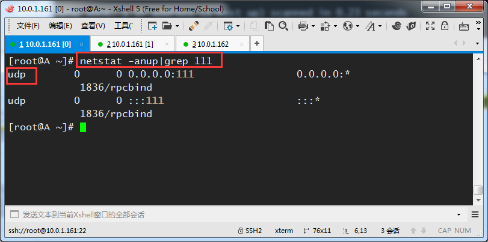

在B机器上使用nmap扫描此端口，是正常的检测到处于open状态
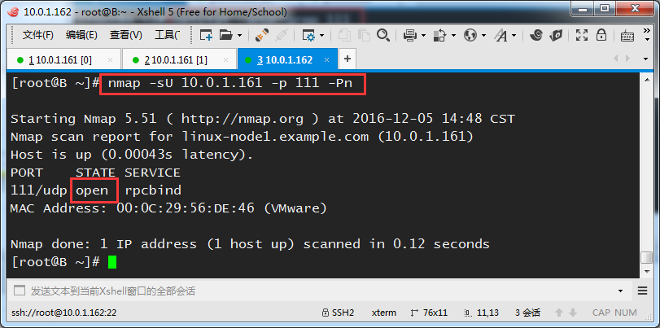

 

**客户端测试，测试方法3**

**nc扫描大量udp端口**

扫描过程比较慢，可能是1秒扫描一个端口，下面表示扫描A机器的1到1000端口（暂未发现可以在一行命令中扫描分散的几个端口的方法）
```bash
nc -vuz 10.0.1.161 1-1000
```


 
# **nc用法2，使用nc传输文件和目录**

**方法1，传输文件演示（先启动接收命令）**

使用nc传输文件还是比较方便的，因为不用scp和rsync那种输入密码的操作了
把A机器上的一个rpm文件发送到B机器上
需注意操作次序，receiver先侦听端口，sender向receiver所在机器的该端口发送数据。  

 
**步骤1，先在B机器上启动一个接收文件的监听，格式如下**

意思是把赖在9995端口接收到的数据都写到file文件里（这里文件名随意取）
```bash
nc -l port >file
nc -l 9995 >zabbix.rpm
```

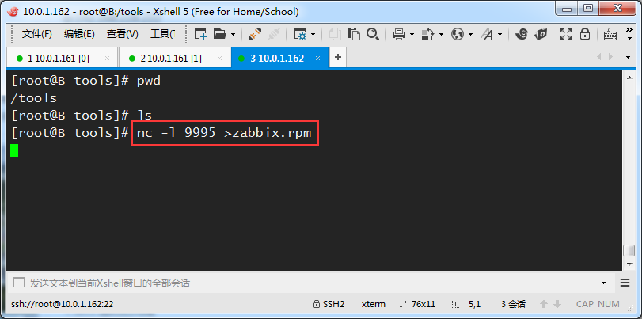

 

***\*步骤2，\**在A机器上往B机器的9995端口发送数据，把下面rpm包发送过去**
```bash
nc 10.0.1.162 9995 < zabbix-release-2.4-1.el6.noarch.rpm
```

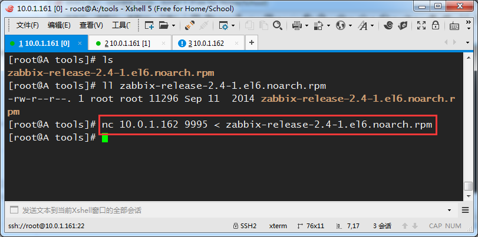

B机器接收完毕，它会自动退出监听，文件大小和A机器一样，md5值也一样
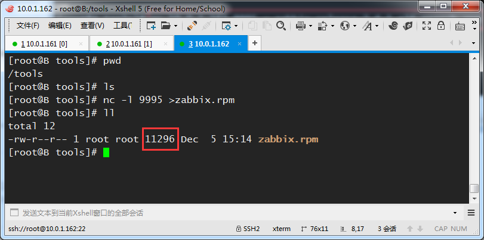


**方法2，传输文件演示（先启动发送命令）**

**步骤1，先在B机器上，启动发送文件命令**

下面命令表示通过本地的9992端口发送test.mv文件
```bash
nc -l 9992 <test.mv
```


 

**步骤2，A机器上连接B机器，取接收文件**

下面命令表示通过连接B机器的9992端口接收文件，并把文件存到本目录下，文件名为test2.mv
```bash
nc 10.0.1.162 9992 >test2.mv
```


 

 

 

**方法3，传输目录演示（方法发送文件类似）**

**步骤1，B机器先启动监听，如下**
A机器给B机器发送多个文件
传输目录需要结合其它的命令，比如tar
经过我的测试管道后面最后必须是 - ，不能是其余自定义的文件名
```bash
nc -l 9995 | tar xfvz -
```
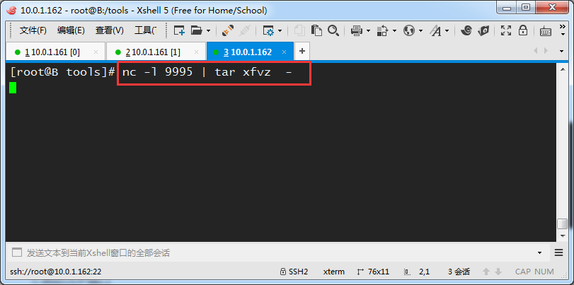

 

**步骤2，A机器打包文件并连接B机器的端口**

管道前面表示把当前目录的所有文件打包为 - ，然后使用nc发送给B机器
```bash
tar cfz - * | nc 10.0.1.162 9995
```


B机器这边已经自动接收和解压
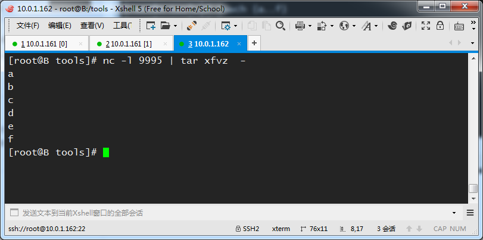


# **nc用法3，测试网速**

测试网速其实利用了传输文件的原理，就是把来自一台机器的/dev/zero 发送给另一台机器的/dev/null
就是把一台机器的无限个0，传输给另一个机器的空设备上，然后新开一个窗口使用dstat命令监测网速
在这之前需要保证机器先安装dstat工具
```bash
yum install -y dstat
```
 

**方法1，测试网速演示（先启动接收命令方式）**

步骤1，A机器先启动接收数据的命令，监听自己的9991端口，把来自这个端口的数据都输出给空设备（这样不写磁盘，测试网速更准确）
```bash
nc -l 9991 >/dev/null
```


步骤2，B机器发送数据，把无限个0发送给A机器的9991端口
```bash
nc 10.0.1.161 9991 </dev/zero
```


在复制的窗口上使用dstat命令查看当前网速，dstat命令比较直观，它可以查看当前cpu，磁盘，网络，内存页和系统的一些当前状态指标。
我们只需要看下面我选中的这2列即可，recv是receive的缩写，表示接收的意思，send是发送数据，另外注意数字后面的单位B，KB，MB


 

可以看到A机器接收数据，平均每秒400MB左右


B机器新打开的窗口上执行dstat，看到每秒发送400MB左右的数据


**方法2，测试网速演示（先启动发送命令方式）**

步骤1，先启动发送的数据，谁连接这个端口时就会接收来自zero设备的数据（二进制的无限个0）
```bash
nc -l 9990 </dev/zero
```
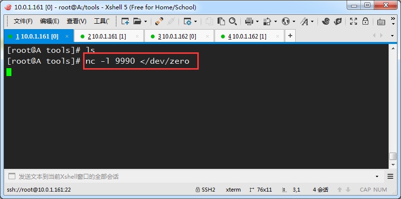

步骤2，下面B机器连接A机器的9990端口，把接收的数据输出到空设备上
```bash
nc 10.0.1.161 9990 >/dev/null
```


同样可以使用dstat观察数据发送时的网速


 

 